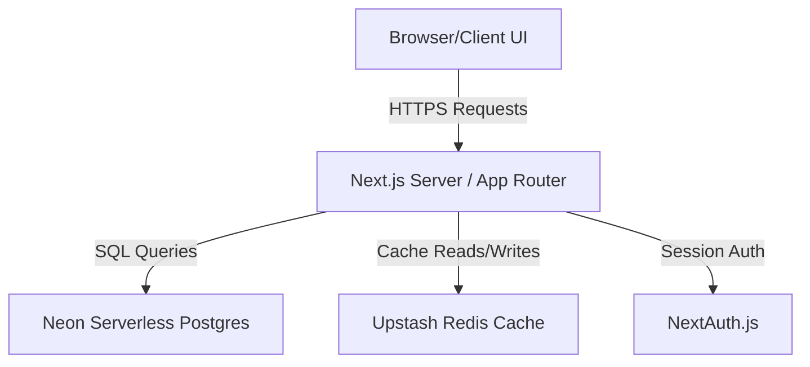
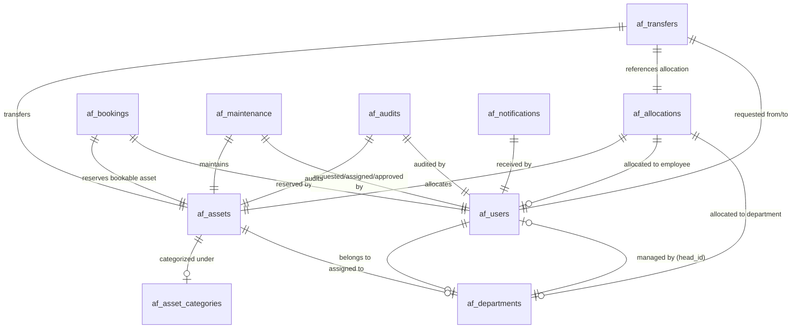

# AssetFlow ERP Architecture Specification

This document defines the system architecture, database design, workflow state machines, role-based access control (RBAC), and API specifications for the **AssetFlow** platform.

---

## 1. System Overview

AssetFlow is built as a modern, type-safe Next.js enterprise application backed by a serverless relational database and caching layer:



- **Frontend & Routing:** Next.js 16 (App Router) utilizing React Server Components (RSC) and Client Components with React Query for state management.
- **Database Layer:** Serverless PostgreSQL via Neon Database, queried using the lightweight `@neondatabase/serverless` SQL client to reduce cold start latency.
- **Caching Layer:** Upstash Redis cache used as a fast read-path for settings configurations to bypass database queries on frequent operations.
- **Authentication:** Credentials-based authentication managed by NextAuth.js, storing session-token cookies on the client side.

---

## 2. Database Schema (11 Tables)

The database schema is designed for full relational integrity and auditability. The primary key structure uses UUIDs across all business objects.

### Entity Relationship Diagram



### Table Definitions

#### 1. `af_users`
Stores user profile, authentication, and organizational role data.
- `id` (UUID, Primary Key, Default: `gen_random_uuid()`)
- `email` (TEXT, UNIQUE, Indexed)
- `password_hash` (TEXT)
- `name` (TEXT)
- `role` (TEXT, Options: `Admin`, `Asset Manager`, `Department Head`, `Employee`)
- `department_id` (UUID, Foreign Key referencing `af_departments(id)`)
- `status` (TEXT, Default: `'active'`)
- `created_at` (TIMESTAMPTZ, Default: `NOW()`)
- `updated_at` (TIMESTAMPTZ, Default: `NOW()`)

#### 2. `af_departments`
Defines organizational divisions, their head, and hierarchy.
- `id` (UUID, Primary Key)
- `name` (TEXT, UNIQUE)
- `description` (TEXT)
- `head_id` (UUID, Foreign Key referencing `af_users(id)`)
- `parent_id` (UUID, Foreign Key referencing `af_departments(id)`)
- `status` (TEXT, Default: `'active'`)
- `created_at` (TIMESTAMPTZ, Default: `NOW()`)

#### 3. `af_asset_categories`
Groups assets and supports custom schema configurations.
- `id` (UUID, Primary Key)
- `name` (TEXT, UNIQUE)
- `description` (TEXT)
- `custom_fields` (JSONB, Default: `'[]'::jsonb`)
- `created_at` (TIMESTAMPTZ, Default: `NOW()`)

#### 4. `af_assets`
The core asset registry containing physical details and status.
- `id` (UUID, Primary Key)
- `asset_tag` (TEXT, UNIQUE, Indexed)
- `name` (TEXT)
- `serial_number` (TEXT, UNIQUE)
- `category_id` (UUID, Foreign Key referencing `af_asset_categories(id)`)
- `status` (TEXT, Default: `'Available'`, Options: `Available`, `Allocated`, `Reserved`, `Under Maintenance`, `Lost`, `Retired`, `Disposed`)
- `condition` (TEXT, Default: `'Good'`, Options: `Excellent`, `Good`, `Fair`, `Poor`)
- `location` (TEXT)
- `department_id` (UUID, Foreign Key referencing `af_departments(id)`)
- `purchase_date` (TIMESTAMPTZ)
- `purchase_cost` (NUMERIC(14,2))
- `warranty_expiry` (TIMESTAMPTZ)
- `acquisition_date` (TIMESTAMPTZ, Default: `NOW()`)
- `notes` (TEXT)
- `is_bookable` (BOOLEAN, Default: `false`)
- `image_url` (TEXT)
- `created_at` (TIMESTAMPTZ, Default: `NOW()`)
- `updated_at` (TIMESTAMPTZ, Default: `NOW()`)

#### 5. `af_allocations`
Tracks the custody/checkout records of assets to users or departments.
- `id` (UUID, Primary Key)
- `asset_id` (UUID, Foreign Key referencing `af_assets(id)`)
- `user_id` (UUID, Foreign Key referencing `af_users(id)`, Nullable for dept-level checkout)
- `department_id` (UUID, Foreign Key referencing `af_departments(id)`, Nullable for employee-level checkout)
- `allocated_at` (TIMESTAMPTZ, Default: `NOW()`)
- `expected_return` (TIMESTAMPTZ)
- `returned_at` (TIMESTAMPTZ)
- `condition_notes` (TEXT)
- `notes` (TEXT)
- `status` (TEXT, Default: `'Active'`, Options: `Active`, `Returned`)

#### 6. `af_transfers`
Facilitates custodial transfers of allocated assets between employees.
- `id` (UUID, Primary Key)
- `asset_id` (UUID, Foreign Key referencing `af_assets(id)`)
- `allocation_id` (UUID, Foreign Key referencing `af_allocations(id)`)
- `from_employee_id` (UUID, Foreign Key referencing `af_users(id)`)
- `to_employee_id` (UUID, Foreign Key referencing `af_users(id)`)
- `status` (TEXT, Default: `'Pending'`, Options: `Pending`, `Approved`, `Rejected`)
- `reason` (TEXT)
- `requested_at` (TIMESTAMPTZ, Default: `NOW()`)
- `approved_at` (TIMESTAMPTZ)
- `approved_by` (UUID, Foreign Key referencing `af_users(id)`)

#### 7. `af_bookings`
Calendar scheduling database for bookable shared assets (e.g., conference rooms).
- `id` (UUID, Primary Key)
- `resource_id` (UUID, Foreign Key referencing `af_assets(id)`)
- `user_id` (UUID, Foreign Key referencing `af_users(id)`)
- `title` (TEXT)
- `start_time` (TIMESTAMPTZ)
- `end_time` (TIMESTAMPTZ)
- `status` (TEXT, Default: `'Upcoming'`, Options: `Upcoming`, `Ongoing`, `Completed`, `Cancelled`)
- `created_at` (TIMESTAMPTZ, Default: `NOW()`)

#### 8. `af_maintenance`
Tracks issues, servicing, repairs, and approvals for asset maintenance.
- `id` (UUID, Primary Key)
- `asset_id` (UUID, Foreign Key referencing `af_assets(id)`)
- `requested_by` (UUID, Foreign Key referencing `af_users(id)`)
- `assigned_to` (UUID, Foreign Key referencing `af_users(id)`)
- `approved_by` (UUID, Foreign Key referencing `af_users(id)`)
- `priority` (TEXT, Default: `'Medium'`, Options: `Low`, `Medium`, `High`, `Critical`)
- `status` (TEXT, Default: `'Pending'`, Options: `Pending`, `Approved`, `In Progress`, `Resolved`, `Rejected`)
- `description` (TEXT)
- `resolution` (TEXT)
- `requested_at` (TIMESTAMPTZ, Default: `NOW()`)
- `approved_at` (TIMESTAMPTZ)
- `completed_at` (TIMESTAMPTZ)

#### 9. `af_audits`
Audit trail records confirming the physical presence and condition of assets.
- `id` (UUID, Primary Key)
- `asset_id` (UUID, Foreign Key referencing `af_assets(id)`)
- `auditor_id` (UUID, Foreign Key referencing `af_users(id)`)
- `found_status` (TEXT)
- `found_condition` (TEXT)
- `discrepancy` (TEXT)
- `notes` (TEXT)
- `audited_at` (TIMESTAMPTZ, Default: `NOW()`)

#### 10. `af_notifications`
Central user alerts system mapping to the notification drawer.
- `id` (UUID, Primary Key)
- `user_id` (UUID, Foreign Key referencing `af_users(id)`)
- `title` (TEXT)
- `message` (TEXT)
- `type` (TEXT, Default: `'INFO'`, Options: `INFO`, `SUCCESS`, `ACTION`, `RISK`)
- `read` (BOOLEAN, Default: `false`)
- `reference_id` (UUID)
- `reference_type` (TEXT)
- `created_at` (TIMESTAMPTZ, Default: `NOW()`)

#### 11. `settings`
Key-value metadata parameters.
- `id` (UUID, Primary Key)
- `key` (TEXT, UNIQUE)
- `value` (TEXT)
- `updated_at` (TIMESTAMPTZ, Default: `NOW()`)

---

## 3. Workflow State Machines

State transitions validate asset custody changes and prevent double-allocations or scheduling conflicts.

### Asset Status Transitions

```
                    ┌──────────────┐
                    │  Available   │
                    └──────┬───────┘
            ┌──────────────┼──────────────┐
            ▼              ▼              ▼
     ┌───────────┐   ┌───────────┐  ┌───────────┐
     │ Allocated │   │ Reserved  │  │  Maint.   │
     └─────┬─────┘   └─────┬─────┘  └─────┬─────┘
           │               │              │
           └───────────────┼──────────────┘
                           ▼
                    ┌──────────────┐
                    │ Lost/Retired │
                    └──────────────┘
```

- **Allocation (Checkout):**
  - Triggers when a new active allocation is saved.
  - Updates asset status to `Allocated`.
  - Asserts that the asset is currently `Available`.
- **Return (Checkin):**
  - Triggers when an active allocation is marked returned.
  - Updates allocation status to `Returned`, sets `returned_at` to `NOW()`.
  - Returns asset status back to `Available`.
- **Maintenance Resolve:**
  - Updates maintenance status to `Resolved`.
  - Restores asset status from `Under Maintenance` to `Available`.

---

## 4. Role-Based Access Control (RBAC)

Permission boundaries are enforced at the API route layer by verifying the `user.role` parameter extracted from the authentication token.

| Role | Access Level | Permissions |
| :--- | :--- | :--- |
| **Admin** | Superuser | System setup, full settings modification, user creation, department creation. |
| **Asset Manager** | Operational Manager | Manage assets, approve maintenance, trigger audits, modify allocations. |
| **Department Head** | Departmental Auditor | View department assets, approve transfers within department, view logs. |
| **Employee** | Custodian / Guest | View assigned assets, request maintenance, request transfers, book shared rooms. |

---

## 5. API Route Specification

The API endpoints enforce RESTful JSON responses.

### 1. Asset Registry `/api/af/assets/`
- `GET`: Lists registered assets with parameters: `status`, `category`, `search`, `bookable`.
- `POST` (Manager/Admin): Registers a new asset.
- `/assets/[id] GET`: Returns single asset profile along with its allocation and maintenance history.
- `/assets/[id] PATCH` (Manager/Admin): Updates asset location, condition, notes, or department.

### 2. Custody Allocations `/api/af/allocations/`
- `GET`: Lists asset checkouts (active or returned history).
- `POST` (Manager/Admin): Checkouts an asset.
- `/allocations/[id]/return POST`: Handles asset returns, checking conditions and updating timestamps.

### 3. Shared Resource Booking `/api/af/bookings/`
- `GET`: Lists schedule bookings.
- `POST`: Creates a booking checking for overlaps (`start_time` and `end_time` check on `resource_id`).
- `/bookings/[id]/cancel POST`: Cancels booking if the requester matches the booking owner.

### 4. Servicing `/api/af/maintenance/`
- `GET`: Returns maintenance orders.
- `POST`: Creates an issue log (updates asset to `Under Maintenance` if priority high/critical).
- `/maintenance/[id]/approve POST` (Manager): Approves requested servicing orders.
- `/maintenance/[id]/resolve POST` (Manager/Assignee): Closes maintenance records, returning the asset to service.

### 5. Settings `/api/settings/`
- `GET`: Hydrates application settings (loads config from Redis/Postgres).
- `PATCH` (Admin): Saves setting key-values and flushes cache.

### 6. Notifications `/api/notifications/`
- `GET`: Retrieves current user alerts drawer list.
- `/notifications/[id] PATCH`: Marks a notification as read.
