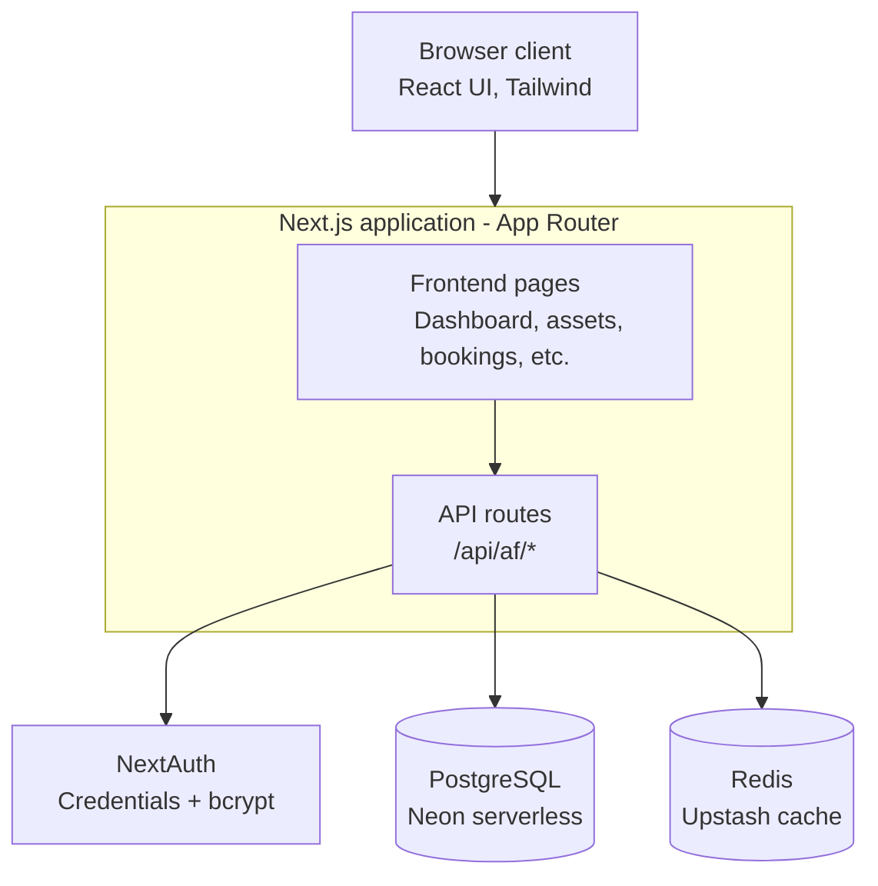

# AssetFlow

AssetFlow is an enterprise asset and resource management system that gives organizations a single, structured place to track equipment, allocate it to the right people, book shared spaces without conflicts, and keep maintenance and audits under proper approval. It's built for any organization that owns physical things and shared spaces - offices, schools, hospitals, factories, agencies - and is currently being developed by our team for Odoo Hackathon '26. The people who use it day to day are admins setting up departments and categories, asset managers registering and allocating equipment, department heads approving requests for their teams, and employees booking rooms or reporting a broken laptop. The business case is simple: spreadsheets and paper logs don't scale, they don't prevent double-booking, and they don't stop someone from allocating an asset that's already with someone else. AssetFlow replaces that with rules the system enforces automatically.

Website - https://assetflow-plum.vercel.app/

## Overview

Most organizations track their assets the same way: a spreadsheet somewhere, updated inconsistently, with no real record of who has what or whether a room is free at 2pm on Tuesday. That works until it doesn't - until two people book the same conference room, or an asset gets allocated to someone when it's already sitting with another employee, or a piece of equipment goes in for repair without anyone approving it first.

AssetFlow is built to close those gaps. It gives every organization a system where assets move through a defined lifecycle (Available, Allocated, Reserved, Under Maintenance, Lost, Retired, Disposed), where allocation conflicts are blocked automatically instead of discovered later, where resource bookings are checked for time overlaps before they're confirmed, and where maintenance work can't start until someone with the right role has approved it. On top of that, scheduled audit cycles let organizations periodically verify that what's on paper matches what's actually in the building.

The system deliberately stays out of purchasing, invoicing, and accounting. It tracks the physical and operational side of assets - not the money.

## Key Features

**Organization setup**
- Department management with optional parent departments for hierarchy
- Asset category management, including category-specific custom fields (for example, warranty period on electronics)
- A central employee directory, which is also the only place roles are assigned

**Asset lifecycle**
- Asset registration with auto-generated asset tags, serial numbers, condition, location, and supporting documents
- Search and filter by tag, serial number, category, status, department, or location
- Full lifecycle tracking across seven states, with per-asset allocation and maintenance history

**Allocation and transfers**
- Allocate assets to an employee or a department, with an optional expected return date
- Automatic conflict blocking - an asset that's already allocated can't be allocated again; the requester is shown who has it and offered a transfer request instead
- Transfer workflow: requested, approved, re-allocated, with history updated automatically
- Return flow with condition check-in notes

**Resource booking**
- Calendar view of a resource's existing bookings
- Overlap validation, so two people can't book the same room for overlapping times
- Cancel and reschedule, with reminder notifications before a booking starts

**Maintenance management**
- Raise a request with issue description, priority, and photo
- Approval required before any repair work starts
- Status flow from pending through technician assignment to resolved, with the asset's status syncing automatically at each step

**Audits**
- Create audit cycles scoped to a department, location, or date range
- Assign one or more auditors
- Mark each asset verified, missing, or damaged
- Auto-generated discrepancy reports, with cycle closure locking the results and updating asset statuses

**Reporting and notifications**
- Utilization trends, maintenance frequency, department allocation summaries, and booking heatmaps
- Full activity log of who did what and when
- Notifications for assignments, approvals, overdue returns, and audit flags

## Screenshots

### Sidebar navigation


This is the current navigation, which still carries the CTA Apparels menu items (CTA Mill, Procurement & Dispatch, Sample Tracking, Style Development, Fabric and Trim Inventory, Supplier Performance) from the base admin template the project was built on. These are not part of AssetFlow and are scheduled for removal as part of the rebrand cleanup.

### Dashboard overview


The dashboard as it renders today, on the CTA Apparels base theme. AssetFlow's own dashboard (KPI cards for available/allocated assets, maintenance due today, active bookings, pending transfers, and upcoming returns) is being built into this same shell.

## System Architecture

**Frontend**
Built with Next.js (App Router) and TypeScript. Pages live under `src/app/(main)/dashboard/`, one folder per module - organization, assets, allocations, transfers, bookings, maintenance, audits, and notifications. UI is composed with Tailwind CSS, shadcn/ui, and Radix primitives, with Zustand for client state and TanStack Query/Table for data fetching and tabular views.

**Backend**
API routes live under `src/app/api/af/` - one route group per module, mirroring the frontend structure (`assets`, `allocations`, `bookings`, `maintenance`, `audits`, `transfers`, `organization`, `notifications`, `dashboard`). These routes are the only layer that talks to the database directly.

**Services**
Authentication runs through NextAuth using the Credentials provider, with passwords hashed via bcrypt. Session and role checks happen at the API layer before any asset, allocation, or booking operation is allowed to proceed.

**Data layer**
PostgreSQL, hosted on Neon, accessed through Neon's serverless driver with raw SQL rather than an ORM. Table definitions and migrations for the AssetFlow-specific tables (`af_users`, `af_departments`, `af_asset_categories`, `af_assets`, `af_allocations`, and related tables) live in `src/lib/assetflow-schema.ts` and run automatically on first request - there's no separate migration step to run by hand.

**Integrations**
Redis (Upstash) is used for caching. The `prisma/` folder and files under `legacy_*` and `_reference/` belong to the CTA Apparels base project this was built on top of and are not part of AssetFlow's data model.

## Architecture Diagram



## Technology Stack

| Layer | Technology |
|---|---|
| Frontend | Next.js 16 (App Router) |
| Language | TypeScript |
| UI Components | shadcn/ui, Radix UI |
| Styling | Tailwind CSS v4 |
| Client State | Zustand |
| Data Fetching | TanStack Query, TanStack Table |
| Forms & Validation | React Hook Form, Zod |
| Authentication | NextAuth (Credentials provider), bcrypt |
| Database | PostgreSQL (Neon serverless driver) |
| Caching | Redis (Upstash) |
| Animation | Framer Motion |
| Tooling | Biome (lint/format), Husky, lint-staged |
| Deployment | Vercel, with a Docker setup for self-hosting |

## Folder Structure

```
AssetFlow/
├── src/
│   ├── app/
│   │   ├── (main)/dashboard/
│   │   │   ├── organization/     # Department, category, and employee directory management
│   │   │   ├── assets/           # Asset registration, search, and per-asset history
│   │   │   ├── allocations/      # Allocation and return handling
│   │   │   ├── transfers/        # Transfer request approvals
│   │   │   ├── bookings/         # Resource booking calendar
│   │   │   ├── maintenance/      # Maintenance request workflow
│   │   │   ├── audits/           # Audit cycle management
│   │   │   ├── notifications/    # Activity log and alerts
│   │   │   └── page.tsx          # Dashboard home
│   │   ├── login/                # Authentication screens
│   │   └── api/af/               # REST endpoints, one folder per module
│   ├── components/erp/           # AssetFlow-specific UI components
│   ├── lib/
│   │   ├── assetflow-schema.ts   # Postgres table definitions and auto-migrations
│   │   └── auth-config.ts        # NextAuth configuration and session handling
│   └── stores/                   # Zustand client state
├── prisma/                       # Legacy schema from the CTA Apparels base, unused by AssetFlow
├── Dockerfile
└── vercel.json
```

## Data Flow

A request starts in the browser, hits a page under `src/app/(main)/dashboard/`, and that page calls the matching route under `src/app/api/af/`. The API route checks the session through NextAuth, runs the relevant business rule (allocation conflict check, booking overlap check, maintenance approval gate, or audit closure logic), reads or writes to PostgreSQL, and returns the result. Frequently accessed data is cached in Redis to reduce repeated database round-trips. The frontend then updates through TanStack Query, which keeps the UI in sync with the server state without a manual refresh.

## Installation

**Prerequisites**
- Node.js 20 or newer
- npm
- A PostgreSQL database (Neon's free tier works well)
- A Redis instance (Upstash), optional, used only for caching

**Steps**

```bash
git clone https://github.com/diwakar-bhagat/odoo_26.git
cd odoo_26/AssetFlow
npm install
cp .env.example .env.local
npm run dev
```

Open `http://localhost:3000`. The required database tables are created automatically on first request through `assetflow-schema.ts`.

## Environment Variables

| Variable | Description |
|---|---|
| `DATABASE_URL` | PostgreSQL connection string (Neon) |
| `NEXTAUTH_SECRET` | Secret used to sign NextAuth session tokens |
| `NEXTAUTH_URL` | Base URL of the running app |
| `UPSTASH_REDIS_REST_URL` | Redis REST endpoint, optional |
| `UPSTASH_REDIS_REST_TOKEN` | Redis REST token, optional |
| `ERP_SYNC_SECRET` | Shared secret for internal ERP sync endpoints |

No secrets are committed to the repository. Copy `.env.example` to `.env.local` and fill in real values locally, or configure them as project environment variables in Vercel.

## Local Development

**Development mode**
```bash
npm run dev
```
Starts the Next.js dev server with hot reload.

**Build mode**
```bash
npm run build
```
Produces a production build, including type checking.

**Production mode**
```bash
npm run start
```
Runs the production build locally, the same way it would run in production.

Before opening a pull request, run `npm run check`, which runs the build and Biome lint together.

## Deployment

The project is configured for Vercel deployment (`vercel.json`), which is the primary target. Environment variables are set in the Vercel project settings rather than committed to the repo. A Dockerfile is also included for teams that prefer to self-host - it builds a standalone Next.js output and runs it on Node 20 (Alpine).

## User Roles

- **Admin** - sets up departments, asset categories, and audit cycles. Promotes employees to Department Head or Asset Manager. Views organization-wide analytics.
- **Asset Manager** - registers and allocates assets. Approves transfers, maintenance requests, audit discrepancies, and returns.
- **Department Head** - views their department's allocated assets, approves allocation and transfer requests within the department, books shared resources on the department's behalf.
- **Employee** - views assets allocated to them, books shared resources, raises maintenance requests, initiates returns and transfers.

Signup only ever creates an Employee account. Department Head and Asset Manager are assigned exclusively by an Admin from the Employee Directory - there is no self-service way to elevate a role.

## Security

Authentication is handled by NextAuth using the Credentials provider, with passwords hashed using bcrypt before storage - plaintext passwords are never persisted. Sessions are validated on every API request before any read or write to asset, allocation, booking, maintenance, or audit data is permitted.

Authorization is role-based and enforced server-side in the API routes, not just hidden in the UI - a Department Head calling an admin-only endpoint directly would still be rejected. Because role assignment only happens through the Admin-controlled Employee Directory, there is no code path that lets a user grant themselves elevated permissions.

## Performance Considerations

TanStack Query caches and deduplicates data fetching on the client, so navigating between screens doesn't trigger unnecessary repeat requests. Redis sits in front of PostgreSQL for frequently accessed data, reducing load on the database for read-heavy operations like dashboard KPIs. The production build runs through Next.js's standard optimizations (route-based code splitting, image optimization, and the standalone output used in the Docker image) to keep bundle size and cold-start time down.

## Future Enhancements

- Finish removing the leftover CTA Apparels navigation items and complete the rebrand of the admin shell
- QR-code based asset lookup for faster physical audits
- Email/SMS delivery for overdue return and booking reminders, in addition to in-app notifications
- Bulk asset import via CSV or Excel
- Exportable audit and utilization reports as PDF

## Contributing

1. Fork the repository and create a feature branch, for example `feature/your-feature-name`
2. Follow the existing module pattern: a page under `src/app/(main)/dashboard/<module>` paired with a route under `src/app/api/af/<module>`
3. Run `npm run check` before pushing
4. Open a pull request describing which screen or module was touched and why

Full branching strategy and day-to-day Git workflow are documented in `TEAM_WORKFLOW.md`.

## License

Distributed under the MIT License. See `LICENSE` for details.
